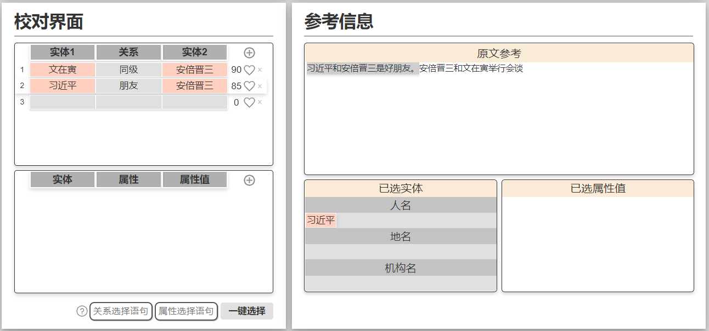

#知识图谱更新工具

## 运行

1.在终端执行 python main2.py，稍等片刻

2.进入浏览器，输入http://localhost:5000/网址

##简介

知识图谱是一种用图模型来描述知识、对不同事物间的关系进行建模的技术。知识图谱以三元组为基本单位，三元组的格式可以表达为 [实体1，关系，实体2]，实体对应图中的节点，关系对应图中的边。

知识图谱的构建过程可以分为：1）信息抽取，包含实体抽取、关系抽取、属性抽取三个子模块。经此过程可获得大量三元组。2）知识融合，包括指代消解和实体消歧两个子模块。经此过程可减少三元组的歧义性，减少三元组的信息冗余。3）知识处理，包括本体抽取，推理补全和质量评价。经此过程可获得知识图谱的模式层，获得更多的衍生信息，确保只存储高质量的信息。

由于自然语言的复杂性，机器自动构建知识图谱的过程中会出现许多错误，所以需要人工进行干预，以保证知识图谱的质量。**该工具的作用是实现人机协同共同构建知识图谱**。该工具包含信息抽取和知识融合两个部分。

该工具为知识抽取、知识融合等算法模型预留了接口，这里只提供纯人工版本的工具以展示交互逻辑。

##使用说明

###一、文本抓取模块

1.点击右上角齿轮进行全局设置。

2.直接在界面内输入文本；或在左下角输入网址，点击抓取获得改网页的文本。

3.确认文本无误后，点击实体/属性抽取。

###二、实体/属性修改模块

用户可在此界面修改自动抽取的实体结果。当前抽取结果有很多错误，这就需要用到右上角的选项卡。可选类别具有扩展性，由用户使用的实体抽取模型决定，这里以三类抽取为例。

1.点击“人名”按钮。

2.按住ctrl键，同时单击实体的第一个字，单击后该字显示红色光晕。

3.按住ctrl键，单击实体的最后一个字，完成对该实体的标注。

4.其他实体执行相同的操作进行标注。

5.点击左上按钮后，不按ctrl单击时，仅将当前字标记为相应类别。

6.最终修改结果如下。

属性抽取模块使用方式和实体抽取模块相同。国籍和性别都是人物的属性，故三者颜色一样。

### 三、实体选择模块

1.右半边是抽取出来的实体，左半边是用户选择的实体。被选择的实体会写入实体词典，下次再碰到同样的实体时，模型可以快速识别。

2.右下角提供实体置信度，表示抽取结果是实体的可能性。当实体较多时，用户可以根据置信度大小一件选择实体到左边。

3.这里同样提供实体修改接口，用户可以通过点击“铅笔”和“更多”修改实体的内容和分类。

4.选择完成后点击关系抽取按钮，开始关系抽取。

### 四、三元组处理模块

该模块的作用是修改三元组并选择写入知识图谱的三元组。前两条是模拟后端算法生成的三元组。第三条是点击加号添加的空白三元组。95, 85, 0 代表该条三元组成立的置信度。

1.鼠标悬浮在三元组上，右边会高亮原文出处。出处位置由后端算法提供，所以用户添加的第三个三元组不具有这个功能。

2.点击三元组即可进行修改，实体输入完成后会被要求选择实体分类。这里要求实体必须是在原文中出现过的实体，否则会抛出警告。点击爱心，爱心会变成实心，相当于用户要把这个三元组写入知识图谱。

3.三元组较多时，可以通过在校对界面的右下角输入三元组选择语句。点击问号查看可用语句。

4.点击一键选择，将用户选择的所有三元组可视化，并开始知识融合步骤。

5.若三元组不完整，纵使用户选择了该条目，程序在上传时也会自动跳过。例如第四条三元组会被忽视。

###五、实体消岐模块

该模块主要是为了解决一词多义现象，将抽取出来的实体链接到知识图谱中已有的实体，以此来消除歧义性。通过点击“更多“修改实体的链接结果。

### 六、图谱可视化模块

1.以图的形式展示抽修改后的三元组，供用户进一步检查

2.检查完成后，点击下载图标，将三元组下载为neo4j数据库存储语句，放在neo4j.txt文件中。

